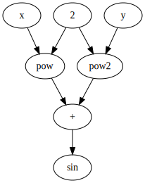
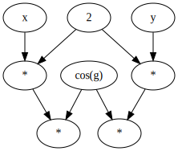

# [DRAFT] Athena Execution Graph

## What is an execution graph?

To train a neural network one needs to find a minimum of a function (called loss
function). To represent the function a graph structure is used. Consider the
following example:

```
f(x, y, z) = sin(x * y) + z
```

The function can be represented with a graph like this:

TBD picture

Athena uses directed acyclic graphs to represent any computation inside
the framework.

## Graph Implementation

Athena Graph stores nodes, that may contain operations, loaders, tensors, etc.
Each graph belongs to one and only one Athena context, and each graph has an ID
and a name unique across the context. Graph manages nodes and their memory for
user, as well as connections between nodes.

The following node types are available in Athena:

* `Node` is a generic node that stores an `Operation` and its parameters.
* `InputNode` is a special node type that allows user to feed graph with data.
* `OutputNode` is a no-op node indicating that output of its predecessor will
be used after graph execution is finished. Any other node chain can be removed
by the backend to save up compute resources.
* `Transfer` is a node type that "transfers" tensor from one graph to another 
without additional memory allocations. Different types of transfers are 
available:
  - `nop transfer` simply prevents tensor from being deallocated. Primarily used
  to transfer nodes between graph and its gradient.
  - `swap transfer` is used to share a tensor between two threads, allowing
  graph level parallelizm.
  - `network transfer` allows graph to be splitted across different machines.

Nodes can be added to graph like this:

```cpp
Graph graph(context, "MainGraph");
auto nodeId = graph.create<Node>(/* constructor arguments */);
```

An internal graph Node ID is returned from this method. Nodes also have names,
that must be unique across the graph. Either of these values can be used
to find node inside the graph later:

```cpp
graph.lookup(nodeId);
graph.lookup("name");
```

Users also define node connections inside the graph:

```cpp
// node1, node2 -- node IDs
graph.connect(node1, node2, 0);
```

creates an oriented edge from node1 to node2, and the newly created edge will
be node2's first argument (indexation starts from 0).

Athena `Graph` class has no copy constructor, but user can still create a copy
of a graph:

```cpp
Graph graph(context, "MainGraph");
auto newGraph = graph.clone(context, "NewGraph");
```

Graph differentiation is available in Athena:

```cpp
// graph
auto [gradGraph, gradNodes] = graph.grad();
```

will return a new graph to compute gradient and a vector of final nodes that
contain gradient values (those are not `Output` nodes). Gradients are calculated
per-node: each node has rules to construct a piece of graph that computes its
gradient.

## Graph Traversal

Athena backends work with a graph traversal that is formed taking into account
node dependencies and possible execution parallelism.

TODO describe traversal algorithm.

## Execution Graph Differentiation

Athena uses chain rule and recursion to differentiate the execution graph. 

Each operation node in Athena Graph can be considered as a function that takes
some inputs and produces an output. Each operation knows how to differentiate
itself, thus can emit necessary nodes to the graph. This operation is applied to
each node in execution graph. To compute a gradient, a starting point must be
specified.

Algorithm pseudocode for node differentiating:

```
function differentiate(node) {
  if (node has inputs) {
    gradients = {differentiate(arguments)}
    return gradients * node.derivative
  } else {
    return unit node
  }
}
```

**Example**

Take the following function:

```
f(x) = sin(x^2 + 2^y)
```
Its gradient can be written as
```
grad(f(x)) = {2*x*cos(x^2 + y^2), 2*y*cos(x^2+y^2)}
```

And the graph would look like this:



So, first Athena takes `sin` node and computes its derivative using pre-defined 
rules. Then, it takes the argument of `sin` and differentiates it. Gradient of a
sum is a vector of gradients of both sum arguments. `cos(g)` is now multiplied
by both of the vector elements.


