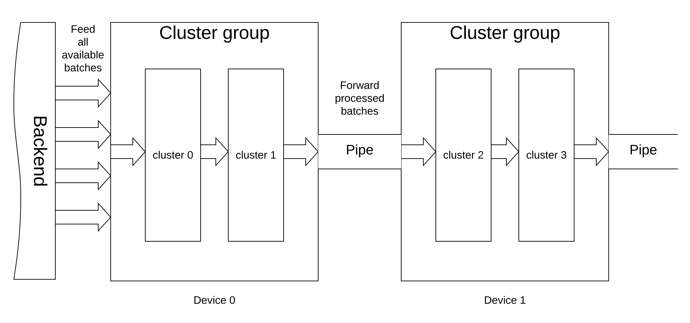

# Batch Garph Execution

A common practice in deep learning is to train neural network in batches, i.e.
propagating a certain number of samples at a time. This document describes
compiler techniques to provide this facility.

## Graph Transformations

Athena Graph can be provided with the batch size. In this case all tensors,
except those that contain network weights, must have batch size as their
first dimension. The operations in this case must allow shape mismatch. On the
other hand, the backend transforms the graph to its "scalar" form by removing
the batch dimension and replacing it with implicit loop. This operation is
called *graph sub-slicing*. The cluster function is re-written to accept current
batch index. All tensors virtual addresses are re-calculated to get sub-tensors.
Allocations are performed for these sub-tensors and passed to the builtins.
Input nodes' loaders are also notified to load only single sample with specific
index. This scheme allows for larger batch sizes with constrained resource
consumption.

<!-- TODO provide MLIR graph Example here -->

## Pipelining

When resources allow (for example, when a single cluster can not be effeciently
parallelized), it is possible to pipeline clusters. 

All clusters are grouped. The number of groups is less or equal to the number
of available devices. One group can own multiple devices. One device only
processes single group. The backend creates `group count` asynchronous queues,
called *pipes*. It then feeds all available batch samples to the first pipe
(the one that has index 0). Each group waits for a sample to be fed into a pipe.
Once a new sample comes from a pipe, cluster group sequentially forwards this
sample to clusters. Once all clusters are executed, the sample is forwarded to
the outgoing pipe, and a new sample is fetched from the incoming pipe. This
process is repeated until the pipe is closed.

